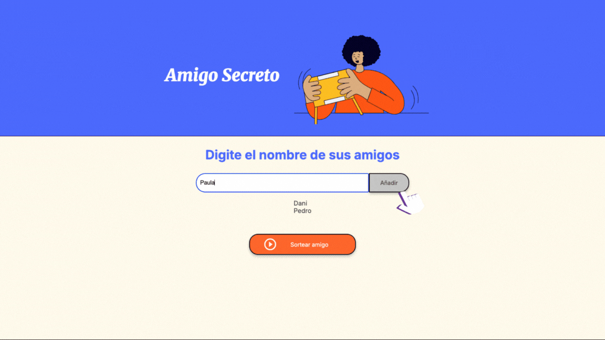

# 🎁 Amigo Secreto

---
# ✨ Descripción

¡Bienvenido/a al juego del **Amigo Secreto**!  
Una aplicación web sencilla y divertida para ingresar una lista de amigos y **sortear uno al azar**.  
Ideal para tus juegos de *amigo secreto* o cualquier selección aleatoria.

---

## ✨ ¿Qué puedes hacer aquí?

- 📝 Agregar nombres a una lista  
- 🚫 Evitar duplicados y caracteres raros
- 👀 Ver la lista de amigos en tiempo real
- 🎲 Sortear un nombre al azar con un clic  
- ⭐ Ver en pantalla el resultado del sorteo  

---

## 🚀 Cómo usarlo

1. **Descarga o clona este repositorio:**  
   ```
   git clone https://github.com/Solebc/Juego-amigo-secreto.git
2. **Abre el archivo index.html en tu navegador favorito 🌐**
- Abrir index.html o hacer doble clic en el archivo desde tu explorador de archivos
3. **Interactuar:**
- Escribe un nombre en el campo y pulsa "Añadir" ➕.
- Continúa agregando nombres
- Cuando termines, haz click en "Sortear amigo"
- Verás quién fue soretado como el **Amigo Secreto** 🎉

---

## 📸 Tutorial



---

## 🛠 Dependencias

Este proyecto es 100% HTML, CSS y JavaScript puro.
👉 No necesitas instalar librerías ni frameworks adicionales.

---

## ⚠️ Posibles problemas

❌ No se agrega un nombre → Puede estar vacío o tener números/símbolos.
❌ No se puede sortear → La lista está vacía, agrega al menos un nombre.
❌ Duplicados → No te preocupes, ya están bloqueados 😉

---

## 📜 Licencia

📄 Proyecto bajo la licencia MIT.
Eres libre de usarlo, modificarlo y compartirlo.

